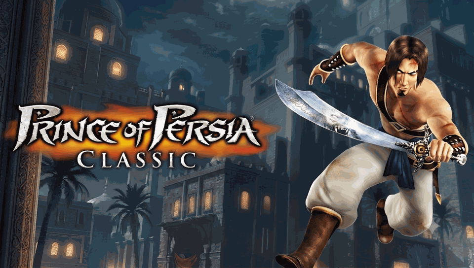

<h1 align="center">
Prince of Persia Classic · PSVita Port
</h1>
<p align="center">
  <a href="#installation-instructions">How to install</a> •
  <a href="#known-issues--current-limitations">Known Issues</a> •
  <a href="#controls">Controls</a> •
  <a href="#build-instructions-for-developers">How to compile</a> •
  <a href="#beta-testing--contributing">Beta Testing / Contributing</a> •
  <a href="Docs/README_ES.md">Versión en Español</a>
</p>

<p align="center">
  
</p>

Prince of Persia Classic is a 2012 release for Android and iOS devices that recreates the levels of the legendary 1989 classic game with modernized 3D graphics.

This repository contains a **wrapper/loader** for the Android version of Prince of Persia Classic (based on Cocos2d-x), adapting the environment to run the native ARM dynamic libraries (`.so`) on the PS Vita using TheFloW's Android SO Loader base.

This is my first PS Vita port and my first homebrew project of this scale — see [Beta Testing / Contributing](#beta-testing--contributing) below, I could really use the help.

## ⚠️ Legal & DMCA Disclaimer
**Prince of Persia Classic** is the intellectual property of Ubisoft Entertainment.
This repository does **NOT** contain any original code, executables, protected binaries, or game assets. It strictly provides the open-source "wrapper" code. The included LiveArea assets are AI-generated or open-source images, free from copyright restrictions. On-screen text is currently rendered with a bundled open-source font ([DejaVu Serif](https://dejavu-fonts.github.io/), Bitstream Vera license) instead of the game's original typeface — see [Known Issues](#known-issues--current-limitations).

To play the game, you MUST possess a legitimate, legally obtained copy of the Android game. Users must manually extract and provide their own files (`.apk`, `.obb`, and `.so` libraries). None of that copyrighted content is tracked in this repository — see `.gitignore` (`*.so`, `*.apk`, `*.obb`, `*.suprx`, `ux0_data/`, `original/`, `bin/`).

---

## Known Issues / Current Limitations

This is an early, actively-developed port. Please read this list before reporting a bug — it may already be a known/tracked issue (see [`Docs/Fixes_Log.md`](Docs/Fixes_Log.md) and [`Docs/plan_portabilidad.md`](Docs/plan_portabilidad.md) for the full technical history).

- **Occasional "stuck action" loop:** the Prince can sometimes get stuck repeating a single action (jump, crouch, or walk) in a loop instead of responding to new input. Several contributing causes have already been found and fixed (invalid audio handles, a zero-volume SFX bug), but it can still resurface in some situations.
- **Cutscenes/videos may not play correctly:** native `.mp4` cutscene playback via Sony's `SceAvPlayer` is implemented, but is **not yet confirmed working on real hardware**. The color conversion assumes planar YUV420 output from the Vita's decoder; if colors look wrong (or the video doesn't render), the codec may actually be outputting NV12 instead.
- **D-Pad currently only makes the Prince Walk, not Run.** Use the **Left Analog Stick** for full movement speed (walk + run) until this is fixed.
- **Audio can still sound slightly distorted** under heavy mixing (e.g. music + footsteps + a sword hit at once), even though a soft limiter was added specifically to reduce this.
- **Occasional FPS drops**, especially on the **Debug** build (see the two VPKs below) since it writes a much more detailed log to the memory card in real time.
- **Not using the game's official fonts yet.** Since Sony's native font APIs (`ScePvf`/`ScePgf`) aren't implemented on Vita3K and pulling in the original Android font assets raised licensing questions, text is currently rendered with the open-source, freely-licensed **DejaVu Serif** font via `stb_truetype`.
- **Not compatible with Vita3K (emulator).** This is a confirmed **bug in Vita3K itself**, not in this port: the menu, text, and audio all work correctly, but starting a real game ("New Game"/"Quick Game") crashes because Vita3K's renderer mishandles non-power-of-2 swizzled textures (confirmed by reading Vita3K's own source, reproducible 3/3 times, and still present on Vita3K's latest `master` at the time of testing). **This port targets real PS Vita hardware.** Technical details in `Docs/plan_portabilidad.md` §9.17.

Found something not on this list? Please open an issue — see [Beta Testing / Contributing](#beta-testing--contributing).

---

## Installation Instructions

### Choosing a VPK: Debug vs. Play build

This project can produce two different VPK builds from the same source, controlled by the CMake option `ENABLE_VERBOSE_LOG`:

| Build | CMake flag | Use it for | Notes |
|---|---|---|---|
| **Play** (recommended) | `-DENABLE_VERBOSE_LOG=OFF` (default) | Actually playing the game | Best performance, no logging overhead. |
| **Debug** | `-DENABLE_VERBOSE_LOG=ON` | Reporting a bug / helping test | Writes a detailed, timestamped trace (module loads, JNI calls, audio/video/scene events) to a log file on the memory card, at the cost of extra I/O and occasional FPS drops. |

If you're not sure which one you need: install the **Play** build. Only switch to the **Debug** build if something is going wrong and you want to grab a log file to attach to a bug report.

### Steps

To install the port on a real PS Vita:

1. Ensure your console is running a CFW that allows signed homebrew (**Enso**, HENkaku/h-encore², etc. — firmware 3.60/3.65 or the currently supported h-encore² range).
2. Install the **kubridge** and **FdFix** plugins by adding them to your `config.txt` under `*KERNEL`:
   ```
   *KERNEL
   ur0:tai/kubridge.skprx
   ur0:tai/fd_fix.skprx
   ```
3. Install `libshacccg.suprx` (Sony's shader compiler). You can obtain a legitimate copy from your own console using the ShaRKBR33D homebrew — it can never be redistributed, so it is **not** included in this repository (`.gitignore`: `*.suprx`).
4. Install the generated `.vpk` (see the table above for Debug vs. Play).
5. Obtain your own legal copy of the Android game (`.apk` + `.obb`). Extract the `.obb` and the `.apk`'s `assets/` folder, and lay them out on the console under `ux0:data/popclassic/` with **exactly** this structure:
   ```
   ux0:data/popclassic/
   ├── libcocos2d.so
   ├── libcocosdenshion.so
   ├── libgame_logic.so
   ├── original.apk                               <- Must be the complete APK
   ├── main.1.org.ubisoft.premium.POPClassic.obb  <- Reconstructed minimal OBB (~511 KB)
   ├── save/                                      <- empty folder, the game writes its saves here
   ├── Data/
   │   ├── Audio/                                 <- all tracks/effects as .mp3 (loose files)
   │   ├── font/                                  <- .ttf files (loose files)
   │   └── Video/High/                            <- cutscenes as .mp4 (loose files)
   └── Data_960_576/                              <- Animations, Effects, Localization, Logo, Maps, Particles, Texture, appConfig.txt
   ```
6. Extract the three native libraries from the `lib/armeabi/` (or `lib/armeabi-v7a/`) folder of your `.apk` and place them directly under `ux0:data/popclassic/` as shown above:
   * `libcocos2d.so`
   * `libcocosdenshion.so`
   * `libgame_logic.so`

For a full step-by-step FTP transfer walkthrough (using VitaShell), see [`Docs/en/INSTALL_HARDWARE.md`](Docs/en/INSTALL_HARDWARE.md).

*(Note: check community forums for patching scripts and tools to prepare your legal APK/OBB files.)*

## Controls

| Button | Action |
|:---:|:---|
| Left Analog Stick | Move Prince (Left/Right, walk **and** run), Crouch (Down), Jump/Climb (Up) |
| D-Pad | Move Prince — currently **Walk only**, see [Known Issues](#known-issues--current-limitations) |
| Cross | Jump |
| Circle | Roll |
| Square | Action / Use Sword |
| Cross / Start | Skip cutscene (during video playback) |
| Start | Pause Menu (Android KEYCODE_BACK) |
| Touchscreen | Touch Menu Navigation |

## Build Instructions (For Developers)

You need the PS Vita SDK compiled with `softfp` support:

```bash
git clone https://github.com/vitasdk-softfp/vdpm
```

Development workflow used for this port:

1. **Set up the toolchain.** Install `vitasdk` (softfp) and export `VITASDK` to point to it.
2. **Clone this repo** and, to run it on your own hardware, rebuild the `ux0_data/popclassic/` asset tree from your own legal APK/OBB (see [Installation Instructions](#installation-instructions) — this folder is gitignored and never shipped).
3. **Build.** Either run CMake directly:
   ```bash
   cmake -S. -Bbuild -DCMAKE_BUILD_TYPE=Release -DENABLE_VERBOSE_LOG=OFF
   cmake --build build
   ```
   or use the interactive helper script, which also offers to install straight to Vita3K for a quick smoke test of menus/UI (see [Known Issues](#known-issues--current-limitations) regarding real gameplay on Vita3K):
   ```bash
   ./build_and_install.sh
   ```
4. **Deploy to real hardware over FTP with VitaShell** and iterate on just the `eboot.bin` (no full reinstall needed per change) — full walkthrough in [`Docs/en/INSTALL_HARDWARE.md`](Docs/en/INSTALL_HARDWARE.md).
5. **Debug.** Build with `-DENABLE_VERBOSE_LOG=ON` for a detailed trace log on the memory card; if the game crashes with no dialog, use the `dump` CMake target (`make dump`) to pull a core dump over FTP and symbolize it against `build/so_loader.elf` with `vita-parse-core`.
6. Check [`Docs/CHANGELOG.md`](Docs/CHANGELOG.md) and [`Docs/Fixes_Log.md`](Docs/Fixes_Log.md) before starting work on a bug — there's a good chance it's already been investigated.

## Beta Testing / Contributing

This is my first time porting anything to a console, and my first Vita homebrew project — I'm sure there's a lot of room for improvement. **I'm actively looking for beta testers** on real PS Vita hardware to help chase down the issues listed above (especially the action-loop bug, cutscene playback, and D-Pad running). Bug reports with a log file from the Debug build are extremely helpful.

**Pull requests are very welcome** — fixes, cleanups, documentation, translations, anything. If you're picking up one of the [Known Issues](#known-issues--current-limitations), feel free to open an issue first to say you're on it, but it's not required.

## Credits

Port / wrapper development: **MetalSyntax**

This project is built on top of [**soloader-boilerplate**](https://github.com/v-atamanenko/soloader-boilerplate) by v-atamanenko, itself based on TheFloW's Android SO Loader approach for the PS Vita. Please keep this credit if you fork or redistribute this wrapper.

This port was made with AI support, using the following models: **Claude Sonnet 5**, **Fable 5**, and **Gemini Pro 3.1**.

## License

This loader is distributed under the MIT License. See the `LICENSE` file for more details.
